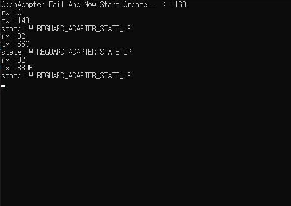

# WireGuardNT PInvoke with Csharp, sharp, Windows

.NET binding over [WireGuardNT](https://git.zx2c4.com/wireguard-nt/about/)

WireGuardNT-PInvoke library written in C# targeting .NET Standard 2.0. Version.


# Example

Save the configuration file to the path of the Example program, and then use the following code to load the configuration file.

Also, I created example project with reference to the following link.  [WireGuardNT/Example.C](https://git.zx2c4.com/wireguard-nt/plain/example/example.c)


### client.conf
``` config
[Interface]
Address = 10.0.0.2/24
ListenPort = 51820
PrivateKey = YOQ2Kcx6FVsrZSaXtR3+hoqIJfKKFSFzWf24kgsnjnA=

[Peer]
PublicKey = ytdGlKJuadDzZPOIPCDpXeJxLCQoGnmtwoUgNJ8aT3g=
AllowedIPs = 0.0.0.0/0, ::/0
Endpoint = myserver.dyndns.org:51820
```

### Example->Program.cs
```C#
...
NET_LUID adapterLuid;
WgConfig WgConfig = new WgConfig();

var baseName = System.IO.Path.GetDirectoryName(Process.GetCurrentProcess().MainModule.FileName); 
var configFile = System.IO.Path.Combine(baseName, "client.conf");
//Read all line from config file
var configAllLinesLine = File.ReadAllLines(configFile);
            
var adapterName = "wgtest";
var tunnelType = "wgtest";

//Create Some GUID
var adapterGuid = Guid.Parse("{0xdeadc001,0xbeef,0xbabe,{0x01,0x23,0x45,0x67,0x89,0xab,0xcd,0xef}}");
//Get Adapter
var adapter = new Adapter(adapterName, tunnelType);
adapter.ParseConfFile(configAllLinesLine, out WgConfig);
...
```
And Run the program.

```
Visual Studio -> Start Example
Run Cmd -> netsh interface show interface or ipconfig
```


# GIF




# Using Cli 

[Release](https://github.com/damob-byun/WireGuardNTSharp/releases)

```
Usage: WireGuard-Cli.exe [OPTION...]
 -v          version
 -c          config "config file path" default path is "client.conf"
 -n          name "adapter name" default name is "client"
 -t          type "tunnel type" default type is "client"
 ```

# Nuget Package

[WireGuardNT-PInvoke](https://www.nuget.org/packages/WireGuardNT-PInvoke)
```
Install-Package WireGuardNT-PInvoke 
```
# TODO

``` TODO
[ ] IPv6 Support
[ ] Code Refactor
[ ] Nuget Package
[ ] Add more example
[ ] TestCode
```

